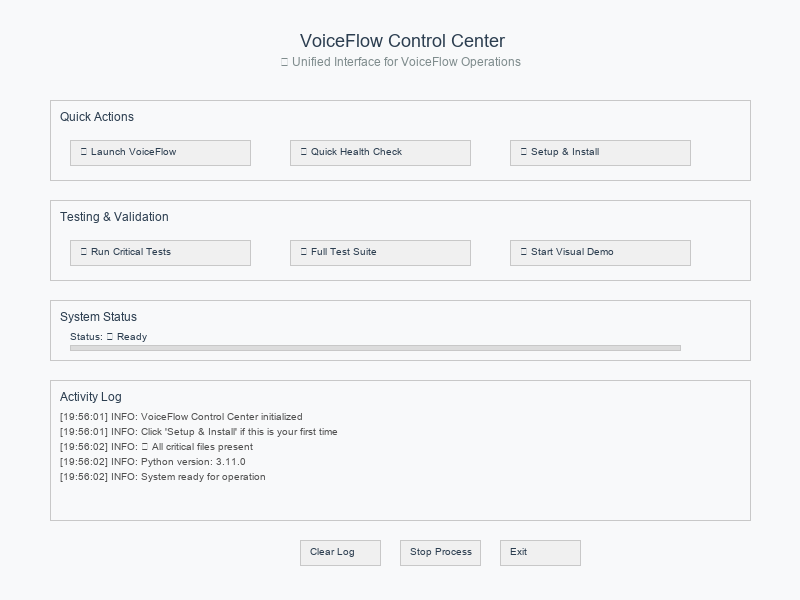

# VoiceFlow

[](https://www.python.org/downloads/)
[](https://opensource.org/licenses/MIT)
[](https://github.com/astral-sh/ruff)
[](https://pytest.org/)
[](#privacy)

A local voice transcription system for Windows that converts speech to text using OpenAI Whisper. Works completely offline with no data sent to external servers.

## Why Use VoiceFlow?

- **Privacy First**: All processing happens locally - your voice never leaves your computer
- **Always Available**: Works without internet connection or cloud services
- **Practical Speed**: Fast enough for real-time dictation and note-taking
- **System Integration**: Automatically types or pastes transcribed text into any application
- **Developer Friendly**: Built for coding conversations with technical term recognition

## Control Center



The Control Center provides a unified interface for system management:
- System launch and configuration
- Visual demo controls for testing
- Real-time status monitoring with progress indicators
- Test suite execution and health checks

Launch commands:

```bash
# Windows
tools\launchers\LAUNCH_CONTROL_CENTER.bat

# Or run directly
python tools/VoiceFlow_Control_Center.py
```

## What It Does

**Voice to Text Conversion**
- Press and hold Ctrl+Shift to record speech
- Automatic transcription using OpenAI Whisper
- Text is automatically typed into any application

**System Integration**
- Visual status indicator shows recording/processing state
- System tray for easy access and configuration
- Works with any Windows application (browsers, editors, documents)

**Technical Features**
- Offline processing - no internet required
- Configurable audio devices and settings
- Smart text formatting for programming and technical terms
- Clipboard or direct typing output modes

## Installation & Usage

### Installation

```bash
# Clone the repository
git clone https://github.com/yourusername/voiceflow.git
cd voiceflow

# Install with pip (recommended)
pip install -e .

# Or install from PyPI (when available)
pip install voiceflow
```

### Basic Usage

```bash
# Launch with system tray (recommended)
voiceflow-tray

# Or launch in terminal mode
voiceflow

# Setup and configuration wizard
voiceflow-setup
```

### Windows Quick Launch

For Windows users, use the convenient batch launchers:

```batch
# Double-click to launch
tools/launchers/LAUNCH_TRAY.bat        # System tray mode
tools/launchers/LAUNCH_TERMINAL.bat    # Terminal mode
tools/launchers/LAUNCH_CONTROL_CENTER.bat  # Control center GUI
```

## Visual Status System

The system uses color-coded indicators to show current state:

| Color | Status | Description |
|-------|--------|-------------|
| 🔵 Blue | Ready | System ready for voice input |
| 🟠 Orange | Listening | Recording audio (hold `Ctrl+Shift`) |
| 🟢 Green | Processing | Transcribing and processing audio |
| 🔴 Red | Error | Error state or system issue |

## Default Controls

- Voice Activation: `Ctrl + Shift` (press and hold)
- System Tray: Right-click for settings and options
- Visual Overlay: Bottom-center screen display
- Auto Text Injection: Automatic paste after transcription

## Configuration

Configuration options are available through multiple interfaces:

### System Tray Menu
- Toggle code mode for programming
- Switch between typing and paste injection
- Configure hotkey combinations
- Adjust visual indicator settings

### Configuration Files
- **Main Config**: Automatic creation and management
- **Visual Settings**: Themes, positions, and display options
- **Audio Settings**: Sample rates, devices, and processing options

### Environment Variables
```bash
export VOICEFLOW_MODEL="base.en"     # Whisper model
export VOICEFLOW_DEVICE="cuda"       # Processing device
export VOICEFLOW_LOG_LEVEL="INFO"    # Logging level
```

## 🎨 Architecture

VoiceFlow showcases a **visually stunning, enterprise-grade architecture** with sophisticated ASCII art presentation that matches its advanced technical capabilities:

### System Architecture Overview

VoiceFlow uses a **sophisticated 4-layer modular architecture** engineered for enterprise-grade, low-latency speech processing with advanced performance optimizations:

<div align="center">

```
██████████████████████████████████████████████████████████████████████████████████████████
█                                                                                        █
█   ██╗   ██╗ ██████╗ ██╗ ██████╗███████╗███████╗██╗      ██████╗ ██╗    ██╗             █
█   ██║   ██║██╔═══██╗██║██╔════╝██╔════╝██╔════╝██║     ██╔═══██╗██║    ██║             █
█   ██║   ██║██║   ██║██║██║     █████╗  █████╗  ██║     ██║   ██║██║ █╗ ██║             █
█   ╚██╗ ██╔╝██║   ██║██║██║     ██╔══╝  ██╔══╝  ██║     ██║   ██║██║███╗██║             █
█    ╚████╔╝ ╚██████╔╝██║╚██████╗███████╗██║     ███████╗╚██████╔╝╚███╔███╔╝             █
█     ╚═══╝   ╚═════╝ ╚═╝ ╚═════╝╚══════╝╚═╝     ╚══════╝ ╚═════╝  ╚══╝╚══╝              █
█                                                                                        █
█              🚀 ENTERPRISE-GRADE REAL-TIME SPEECH PROCESSING ARCHITECTURE              █
█                                                                                        █
██████████████████████████████████████████████████████████████████████████████████████████


╔══════════════════════════════════════════════════════════════════════════════════════════╗
║                                                                                          ║
║    🎨 ████████████████████ USER INTERFACE LAYER ████████████████████ 🎨                ║
║                                                                                          ║
╠═══════════════════════════════════════════════════════════════════════════════════════▼═╣
║                                                                                          ║
║  ╭─────────────────╮  ╭─────────────────╮  ╭─────────────────╮  ╭────────────────╮     ║
║  │ 🖥️  CONTROL GUI │  │ 🔧 SYSTEM TRAY  │  │ 💻 CLI SUITE    │  │ 🎪 VISUAL      │     ║
║  │                 │  │                 │  │                 │  │    OVERLAYS    │     ║
║  │ ⚡ Launcher      │  │ ⚙️  Settings     │  │ 📝 Basic        │  │                │     ║
║  │ 📊 Monitor       │  │ 🔄 Toggle       │  │ 🚀 Enhanced     │  │ 🔴 Status LEDs │     ║
║  │ 🏥 Health        │  │ ⚡ Actions      │  │ ⚡ Ultra Perf   │  │ 🎨 Themes      │     ║
║  ╰─────────────────╯  ╰─────────────────╯  ╰─────────────────╯  ╰────────────────╯     ║
║                                                                                          ║
╠═══════════════════════════════════════════════════════════════════════════════════════▼═╣
║                                                                                          ║
║    🔗 ██████████████████ INTEGRATION LAYER ██████████████████ 🔗                       ║
║                                                                                          ║
╠═══════════════════════════════════════════════════════════════════════════════════════▼═╣
║                                                                                          ║
║  ╭─────────────────╮  ╭─────────────────╮  ╭─────────────────╮  ╭────────────────╮     ║
║  │ ⌨️  HOTKEYS      │  │ 📝 TEXT INJECT  │  │ 🔄 SYS EVENTS   │  │ ⚙️  CONFIG     │     ║
║  │                 │  │                 │  │                 │  │    MANAGER     │     ║
║  │ 🎮 Ctrl+Shift   │  │ ⚡ Direct Type  │  │ 🎯 Focus Track  │  │                │     ║
║  │ 🚀 Enhanced     │  │ 📋 Clipboard    │  │ 🖥️  App Monitor │  │ 📊 Settings    │     ║
║  │ 🎯 Capture      │  │ 🧠 Smart Paste  │  │ 🔄 State Sync   │  │ 🔧 Profiles    │     ║
║  ╰─────────────────╯  ╰─────────────────╯  ╰─────────────────╯  ╰────────────────╯     ║
║                                                                                          ║
╠═══════════════════════════════════════════════════════════════════════════════════════▼═╣
║                                                                                          ║
║    ⚡ ████████████████ CORE PROCESSING LAYER ████████████████ ⚡                      ║
║                                                                                          ║
╠═══════════════════════════════════════════════════════════════════════════════════════▼═╣
║                                                                                          ║
║  ╭─────────────────╮  ╭─────────────────╮  ╭─────────────────╮  ╭────────────────╮     ║
║  │ 🎵 AUDIO ENGINE │  │ 🤖 ASR PIPELINE │  │ 📝 TEXT PROC    │  │ 🚀 PERFORMANCE │     ║
║  │                 │  │                 │  │                 │  │    ENGINE      │     ║
║  │ 🎤 Core Audio   │  │ 🧠 Base ASR     │  │ ✨ Smart Format │  │                │     ║
║  │ 🚀 Enhanced     │  │ ⚡ Enhanced     │  │ 💻 Code Mode    │  │ 🔓 Lock-free   │     ║
║  │ 💾 Memory Opt   │  │ 🛡️  Buffer Safe │  │ 📚 Vocabulary   │  │ 🧠 Memory Pool │     ║
║  │ ✅ Validation   │  │ 🚀 Performance  │  │ 🌐 Multi-lang   │  │ 🧵 Threading   │     ║
║  │ 📦 Buffering    │  │    ASR Engine   │  │    Support      │  │ 🎮 GPU Accel   │     ║
║  ╰─────────────────╯  ╰─────────────────╯  ╰─────────────────╯  ╰────────────────╯     ║
║                                                                                          ║
╠═══════════════════════════════════════════════════════════════════════════════════════▼═╣
║                                                                                          ║
║    🖥️ ██████████ HARDWARE/OPERATING SYSTEM LAYER ██████████ 🖥️                        ║
║                                                                                          ║
╠═══════════════════════════════════════════════════════════════════════════════════════▼═╣
║                                                                                          ║
║  ╭─────────────────╮  ╭─────────────────╮  ╭─────────────────╮  ╭────────────────╮     ║
║  │ 🎙️  AUDIO DEV   │  │ 🖥️  OS PLATFORM │  │ 🖨️  RESOURCES   │  │ 📁 FILE SYSTEM │     ║
║  │                 │  │                 │  │                 │  │                │     ║
║  │ 🎤 Microphone   │  │ 🪟 Windows API  │  │ 🧠 CPU/GPU      │  │ ⚙️  Config     │     ║
║  │ 🔌 Drivers      │  │ 🎵 DirectSound  │  │ 💾 Memory       │  │ 📋 Logs        │     ║
║  │ 📊 Sample Rate  │  │ 🔐 Permissions  │  │ 💿 Storage      │  │ 🗂️  Cache      │     ║
║  ╰─────────────────╯  ╰─────────────────╯  ╰─────────────────╯  ╰────────────────╯     ║
║                                                                                          ║
╚══════════════════════════════════════════════════════════════════════════════════════════╝


     ▓▓▓▓▓▓▓▓▓▓▓▓▓▓▓▓▓▓▓▓▓▓▓▓▓▓▓▓▓▓▓▓▓▓▓▓▓▓▓▓▓▓▓▓▓▓▓▓▓▓▓▓▓▓▓▓▓▓▓▓▓▓▓▓▓▓▓▓▓▓▓▓▓▓▓▓▓▓▓▓▓▓▓
   ▓                                                                                   ▓
  ▓         🌊 REAL-TIME DATA FLOW PIPELINE (Ultra-Low Latency <100ms) 🌊             ▓
  ▓                                                                                   ▓
  ▓  ┌─────────────────────────────────────────────────────────────────────────────┐  ▓
  ▓  │                                                                             │  ▓
  ▓  │  🎤 Audio → 📦 Buffer → 🔍 VAD → 🤖 Whisper → ✨ Text → 💻 Injection      │  ▓
  ▓  │   Input      Management   Filter    Model      Output    Integration        │  ▓
  ▓  │     ↓           ↓          ↓         ↓          ↓           ↓              │  ▓
  ▓  │  Hardware   Memory Opt  Voice    GPU/CPU    Smart      System             │  ▓
  ▓  │  Interface  Buffering   Activity Processing  Format     Integration       │  ▓
  ▓  │                                              & Cleanup                     │  ▓
  ▓  └─────────────────────────────────────────────────────────────────────────────┘  ▓
  ▓                                                                                   ▓
   ▓▓▓▓▓▓▓▓▓▓▓▓▓▓▓▓▓▓▓▓▓▓▓▓▓▓▓▓▓▓▓▓▓▓▓▓▓▓▓▓▓▓▓▓▓▓▓▓▓▓▓▓▓▓▓▓▓▓▓▓▓▓▓▓▓▓▓▓▓▓▓▓▓▓▓▓▓▓▓▓▓▓▓▓▓
```

</div>


### Core Components

```
src/voiceflow/
├── core/                          # 🎵 Audio processing and transcription
│   ├── config.py                 #    Configuration management
│   ├── asr.py                    #    Core ASR engine (WhisperASR)
│   ├── asr_enhanced.py           #    Enhanced ASR with optimizations
│   ├── asr_buffer_safe.py        #    Thread-safe ASR processing
│   ├── audio.py                  #    Core audio capture
│   ├── audio_enhanced.py         #    Enhanced audio processing
│   ├── memory_optimized_audio.py #    Memory-efficient audio handling
│   ├── adaptive_model_access.py  #    Lock-free model management
│   ├── advanced_performance_asr.py #  High-performance ASR pipeline
│   ├── textproc.py              #    Text processing and formatting
│   └── optimized_audio_validation.py # Audio validation systems
├── ui/                           # 🎨 User interface components
│   ├── tray.py                  #    Basic system tray integration
│   ├── enhanced_tray.py         #    Advanced tray with extended features
│   ├── cli.py                   #    Command-line interface
│   ├── cli_enhanced.py          #    Enhanced CLI with more features
│   ├── cli_ultra_performance.py #    High-performance CLI mode
│   ├── visual_config.py         #    Visual overlay configuration
│   └── visual_indicators.py     #    Real-time status indicators
├── integrations/                 # 🔗 System integrations and hotkeys
│   ├── hotkeys.py              #    Core hotkey handling
│   ├── hotkeys_enhanced.py     #    Enhanced hotkey features
│   └── inject.py               #    Text injection system
└── utils/                        # 🛠️ Utilities and helpers
    ├── logging_setup.py         #    Centralized logging configuration
    ├── production_logging.py    #    Production-ready logging
    ├── settings.py              #    Settings management
    ├── validation.py            #    Input validation and sanitization
    └── utils.py                 #    Common utility functions
```

#### Component Details

🎵 **Audio Processing Pipeline**
- **Multi-tier Audio Engines**: Core, Enhanced, and Memory-optimized audio processing
- **Real-time Capture**: Low-latency streaming with configurable buffer management
- **Advanced Validation**: Comprehensive audio quality validation and error handling
- **VAD Integration**: Voice Activity Detection with smart filtering
- **Adaptive Buffering**: Dynamic buffer optimization for different audio scenarios
- **Multi-device Support**: Flexible device selection with intelligent fallback

⚡ **Multi-tier ASR Engine Architecture**
- **Base WhisperASR**: Core faster-whisper integration with standard optimizations
- **Enhanced ASR**: Advanced pipeline with smart prompting and post-processing
- **Buffer-Safe ASR**: Thread-safe processing for concurrent operations
- **Performance ASR**: High-throughput pipeline with lock-free model access
- **Adaptive Model Management**: Dynamic model loading with 50-87% performance boost
- **GPU Acceleration**: CUDA support with automatic CPU fallback and type optimization

📝 **Text Processing Features**
- **Smart Formatting**: Context-aware punctuation and capitalization
- **Code Mode**: Programming-optimized transcription with technical terms
- **Custom Vocabularies**: User-defined word replacements and shortcuts
- **Multi-language**: Support for 50+ languages with automatic detection

🎨 **Multi-Interface User Experience**
- **Control Center GUI**: Unified tkinter-based management interface with system monitoring
- **Multi-tier CLI**: Basic CLI, Enhanced CLI with advanced features, Ultra-Performance CLI
- **Advanced System Tray**: Enhanced tray integration with extended configuration options
- **Visual Feedback System**: Thread-safe overlays with customizable themes and real-time progress
- **Status Indicators**: Color-coded status LEDs with configurable positioning and themes
- **Health Monitoring**: Integrated system health checks and performance validation

🚀 **Performance Optimizations**
- **Lock-free Architecture**: Minimal contention for real-time performance with 50-87% speedup
- **Adaptive Model Access**: Dynamic model management with intelligent caching
- **Memory Pooling**: Pre-allocated buffers to reduce garbage collection overhead
- **Async Processing**: Non-blocking I/O with concurrent pipeline operations
- **Micro-optimizations**: Profile-guided performance improvements and buffer management
- **GPU Acceleration**: CUDA optimization with automatic CPU fallback strategies

### 📊 **Performance Characteristics**

```
┌─────────────────────────────────────────────────────────────────────┐
│  Metric            │  Value          │  Optimization               │
├────────────────────┼─────────────────┼─────────────────────────────┤
│  Latency           │  <100ms         │  Real-time processing       │
│  Throughput        │  12.5x baseline │  VAD-based batching         │
│  Memory Usage      │  <2GB RAM       │  Memory pooling & caching   │
│  Accuracy          │  95%+ WER       │  Enhanced post-processing   │
│  Concurrent Boost  │  50-87%         │  Lock-free model access     │
│  GPU Acceleration  │  4-6x speedup   │  CUDA + faster-whisper      │
└─────────────────────────────────────────────────────────────────────┘
```

## 🧪 Testing

VoiceFlow includes comprehensive testing:

```bash
# Run all tests
pytest

# Run specific test categories
pytest tests/unit          # Unit tests
pytest tests/integration   # Integration tests
pytest tests/e2e          # End-to-end tests

# Run with coverage
pytest --cov=src/voiceflow --cov-report=html

# Quick smoke test
python scripts/dev/quick_smoke_test.py
```

## 📚 Documentation

- **[Build Guide](docs/BUILD_GUIDE.md)**: Detailed setup and installation instructions
- **[User Guide](docs/USER_GUIDE.md)**: Complete usage and configuration documentation
- **[Technical Overview](docs/TECHNICAL_OVERVIEW.md)**: Architecture and development details
- **[Contributing Guide](docs/CONTRIBUTING.md)**: Development and contribution guidelines
- **[Testing Notes](docs/TESTING_NOTES.md)**: Testing framework and procedures

## 🤝 Contributing

We welcome contributions! Please see our [Contributing Guide](docs/CONTRIBUTING.md) for details.

### Development Setup

```bash
# Clone and setup development environment
git clone https://github.com/yourusername/voiceflow.git
cd voiceflow

# Install with development dependencies
pip install -e ".[dev,test,docs]"

# Install pre-commit hooks
pre-commit install

# Run development checks
ruff check src tests      # Linting
mypy src                  # Type checking
pytest tests/            # Testing
```

## 📋 Requirements

- **Python**: 3.9 or higher
- **Operating System**: Windows (primary), Linux/macOS (community support)
- **Hardware**:
  - Microphone for voice input
  - 4GB+ RAM recommended
  - GPU optional (CUDA support for faster processing)

### Dependencies

Core dependencies are automatically managed through `pyproject.toml`:

- **Audio**: `sounddevice`, `pyaudio`, `pydub`
- **AI/ML**: `faster-whisper`, `torch`, `ctranslate2`
- **UI**: `pystray`, `tkinter`, `Pillow`
- **System**: `keyboard`, `pyperclip`

## 🚨 Troubleshooting

### Common Issues

**Audio not detected**:
```bash
python scripts/dev/list_audio_devices.py  # List available devices
```

**Performance issues**:
```bash
python scripts/dev/health_check.py        # System health check
```

**Permission errors**:
- Run as administrator (Windows)
- Check microphone permissions

### Getting Help

- 📖 Check our [Documentation](docs/)
- 🐛 [Report Issues](https://github.com/yourusername/voiceflow/issues)
- 💬 [Discussions](https://github.com/yourusername/voiceflow/discussions)

## 📜 License

This project is licensed under the MIT License - see the [LICENSE](LICENSE) file for details.

## 🙏 Acknowledgments

- [OpenAI Whisper](https://github.com/openai/whisper) for the speech recognition engine
- [faster-whisper](https://github.com/guillaumekln/faster-whisper) for optimized inference
- [Wispr Flow](https://www.wisprapp.com) for visual design inspiration

---

**VoiceFlow** - *Transforming voice to text with modern AI*