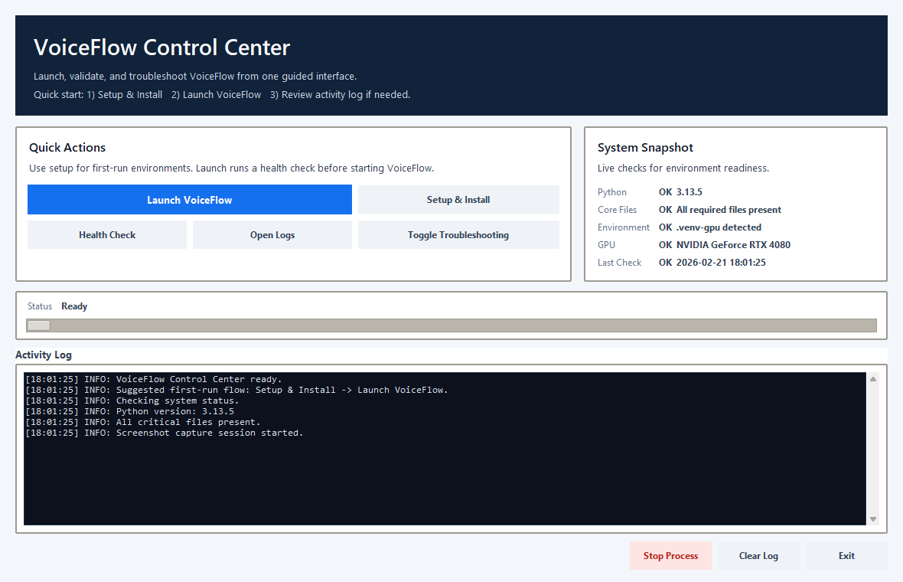
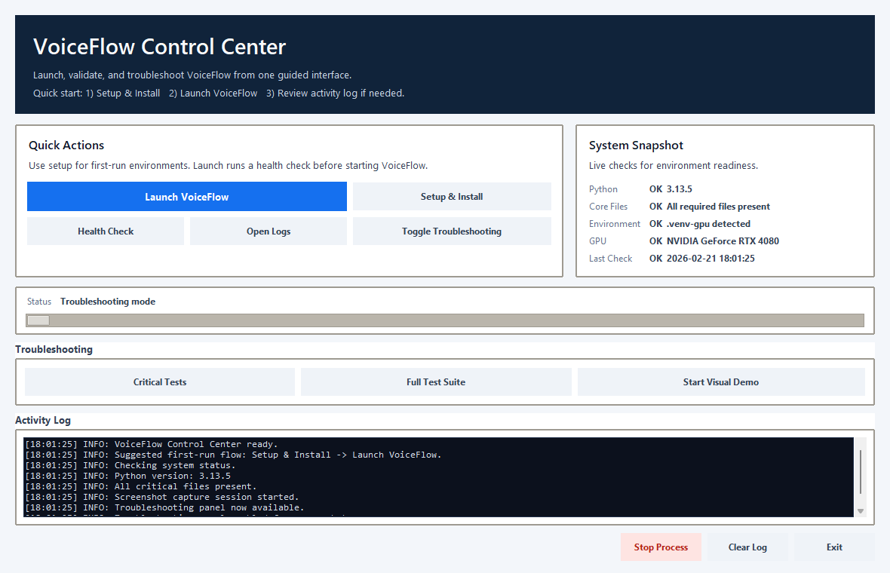

# VoiceFlow

[](https://www.python.org/downloads/)
[](https://opensource.org/licenses/MIT)
[](https://pytest.org/)

VoiceFlow is a Windows-first, local push-to-talk transcription app for technical work.
Hold a hotkey to record, release to transcribe, and inject text directly into your active app.

## Why VoiceFlow

- Fast release-to-text turnaround for short and long dictation.
- Local-first runtime with no required cloud ASR service.
- Tray + overlay UX with recent-history recovery and correction review.
- Adaptive learning from your own correction patterns over time.

## UI Preview

<p align="center">
  
  
</p>

## Core Features

- Push-to-talk dictation (`Ctrl+Shift` default).
- Context-aware transcript formatting for editor/chat/terminal destinations.
- Correction review workflow (compare original vs corrected text).
- Recent history panel with copy/expand and recovery behavior.
- Optional adaptive learning with local retention controls.
- Daily offline learning batch job from previous-day conversation/correction data.

## Install

### Option A: Setup EXE (recommended for non-developers)

1. Download `VoiceFlow-Setup-<version>.exe` from Releases.
2. Run the installer.
3. Launch `VoiceFlow` from Start Menu.

Guides:
- `docs/guides/WINDOWS_SETUP_EXECUTABLE.md`
- `docs/guides/WINDOWS_EXECUTABLE_EVALUATION.md`

### Option B: One-click source install

```powershell
.\Install_VoiceFlow.bat
```

This runs `scripts/setup/bootstrap_windows.ps1`, installs dependencies, runs smoke checks, and launches VoiceFlow.

### Option C: Manual source install

```powershell
git clone https://github.com/yourusername/voiceflow.git
cd voiceflow
python -m venv venv
.\venv\Scripts\activate
pip install --upgrade pip
pip install -r scripts\setup\requirements_windows.txt
.\VoiceFlow_Quick.bat
```

## Daily Learning (Self-Improvement Batch Job)

VoiceFlow includes an offline daily learning job that reviews prior-day transcripts and saved correction edits.

Manual run:

```powershell
.\VoiceFlow_DailyLearning.bat
```

Dry run:

```powershell
.\VoiceFlow_DailyLearning.bat --dry-run
```

Register daily schedule (example: 08:00 every morning):

```powershell
powershell -ExecutionPolicy Bypass -File .\scripts\setup\register_daily_learning_task.ps1 -StartTime "08:00" -Force
```

Remove schedule:

```powershell
powershell -ExecutionPolicy Bypass -File .\scripts\setup\unregister_daily_learning_task.ps1
```

## Launch Modes

| Mode | Command | Use Case |
|---|---|---|
| Standard | `VoiceFlow.bat` | Console-visible runtime |
| Quick | `VoiceFlow_Quick.bat` | Daily use, no pause on exit |
| Silent tray | `VoiceFlow_Silent.bat` | Background startup |
| Daily learning | `VoiceFlow_DailyLearning.bat` | Previous-day learning pass |
| Control Center | `tools\launchers\LAUNCH_CONTROL_CENTER.bat` | Guided diagnostics and launch |

## Security and Privacy

- Processing is local-first; no cloud API is required for core ASR.
- Clipboard injection supports restore-after-paste behavior.
- Adaptive learning data is stored locally under `%LOCALAPPDATA%\LocalFlow`.
- Daily learning reports are local JSON artifacts for review/auditing.

Security notes:
- `docs/guides/SECURITY_AND_PRIVACY.md`
- `docs/reports/SECURITY_ASSESSMENT_REPORT.md`

## Runtime Paths (Windows)

- Config: `%LOCALAPPDATA%\LocalFlow\config.json`
- Logs: `%LOCALAPPDATA%\LocalFlow\logs\localflow.log`
- Recent history: `%LOCALAPPDATA%\LocalFlow\recent_history_events.jsonl`
- Correction review data: `%LOCALAPPDATA%\LocalFlow\transcription_corrections.jsonl`
- Adaptive patterns: `%LOCALAPPDATA%\LocalFlow\adaptive_patterns.json`
- Adaptive audit: `%LOCALAPPDATA%\LocalFlow\adaptive_audit.jsonl`
- Daily learning reports: `%LOCALAPPDATA%\LocalFlow\daily_learning_reports\`

## Architecture Snapshot

```
src/voiceflow/
  core/          audio capture, ASR, streaming, text formatting
  integrations/  hotkeys and text injection
  ui/            tray, overlay, CLI runtime
  ai/            correction, command mode, adaptive + daily learning
  utils/         settings, logging, guardrails, monitors
```

Detailed docs:
- `docs/ARCHITECTURE.md`
- `docs/TECHNICAL_OVERVIEW.md`

## Validation

Quick checks:

```powershell
python scripts\dev\quick_smoke_test.py
pytest -q tests\test_textproc.py tests\test_injector_logic.py tests\test_sanitization_and_rate.py
```

Focused daily-learning checks:

```powershell
pytest -q tests\unit\test_daily_learning.py tests\test_adaptive_memory.py --no-cov
```

## Troubleshooting

```powershell
python scripts\list_audio_devices.py
python scripts\debugging\debug_hang_issue.py
python scripts\debugging\debug_nonetype_issue.py
```

If text does not inject into elevated apps, run VoiceFlow with matching permissions.

## Documentation Map

- `docs/README.md` - docs index
- `docs/HOW_TO_LAUNCH.md` - launch and startup modes
- `docs/USER_GUIDE.md` - workflow and settings
- `docs/BUILD_GUIDE.md` - build + packaging
- `docs/CONTRIBUTING.md` - contributor workflow
- `docs/guides/UI_POLISH_REVIEW.md` - current UI polish baseline + next-step backlog

## License

MIT. See `LICENSE`.
