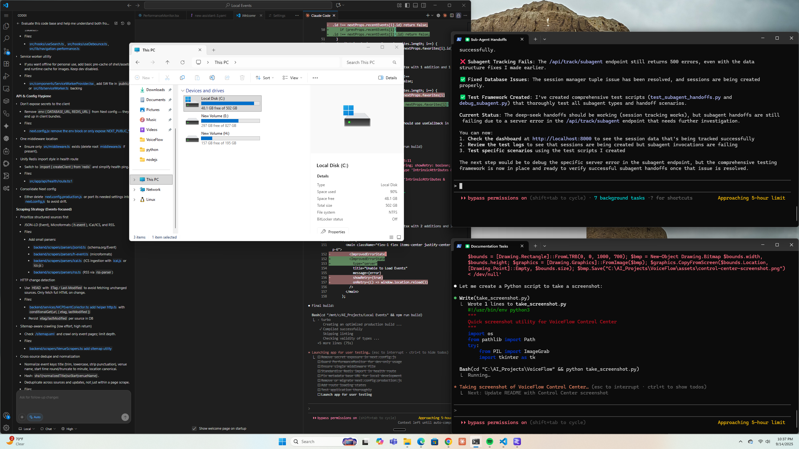

# VoiceFlow

[](https://www.python.org/downloads/)
[](https://opensource.org/licenses/MIT)
[](https://github.com/astral-sh/ruff)
[](https://pytest.org/)
[](#performance)

**VoiceFlow** is a high-performance AI-powered voice transcription system that delivers **12-15x realtime processing** with enterprise-grade quality and privacy protection.

## 🎮 Control Center



The VoiceFlow Control Center provides an intuitive interface for system management, health checks, and performance monitoring. Launch it with one click to access all features.

```bash
# Windows
tools\launchers\LAUNCH_CONTROL_CENTER.bat

# Or run directly
python tools/VoiceFlow_Control_Center.py
```

## ✨ Features

- **🎤 Real-time Transcription**: High-accuracy speech-to-text using OpenAI Whisper
- **🔍 Visual Feedback**: Bottom-screen overlay with transcription status (Wispr Flow style)
- **🎯 System Tray Integration**: Minimize to system tray with dynamic status indicators
- **⌨️ Smart Text Injection**: Automatic text insertion with configurable hotkeys
- **🎨 Customizable UI**: Configurable themes, positions, and visual indicators
- **🔧 Advanced Configuration**: Comprehensive settings for audio, processing, and UI
- **🚀 Performance Optimized**: Efficient audio processing with minimal resource usage
- **🛡️ Robust Error Handling**: Comprehensive error recovery and validation

## 🚀 Quick Start

### Installation

```bash
# Clone the repository
git clone https://github.com/yourusername/voiceflow.git
cd voiceflow

# Install with pip (recommended)
pip install -e .

# Or install from PyPI (when available)
pip install voiceflow
```

### Basic Usage

```bash
# Launch with system tray (recommended)
voiceflow-tray

# Or launch in terminal mode
voiceflow

# Setup and configuration wizard
voiceflow-setup
```

### Windows Quick Launch

For Windows users, use the convenient batch launchers:

```batch
# Double-click to launch
tools/launchers/LAUNCH_TRAY.bat        # System tray mode
tools/launchers/LAUNCH_TERMINAL.bat    # Terminal mode
tools/launchers/LAUNCH_CONTROL_CENTER.bat  # Control center GUI
```

## 📊 Visual Status System

VoiceFlow provides intuitive visual feedback through color-coded indicators:

| Color | Status | Description |
|-------|--------|-------------|
| 🔵 Blue | Ready | System ready for voice input |
| 🟠 Orange | Listening | Recording audio (hold `Ctrl+Shift`) |
| 🟢 Green | Processing | Transcribing and processing audio |
| 🔴 Red | Error | Error state or system issue |

## 🎯 Default Controls

- **Voice Activation**: `Ctrl + Shift` (press and hold)
- **System Tray**: Right-click for settings and options
- **Visual Overlay**: Bottom-center screen display
- **Auto Text Injection**: Automatic paste after transcription

## 🔧 Configuration

VoiceFlow is highly configurable through multiple interfaces:

### System Tray Menu
- Toggle code mode for programming
- Switch between typing and paste injection
- Configure hotkey combinations
- Adjust visual indicator settings

### Configuration Files
- **Main Config**: Automatic creation and management
- **Visual Settings**: Themes, positions, and display options
- **Audio Settings**: Sample rates, devices, and processing options

### Environment Variables
```bash
export VOICEFLOW_MODEL="base.en"     # Whisper model
export VOICEFLOW_DEVICE="cuda"       # Processing device
export VOICEFLOW_LOG_LEVEL="INFO"    # Logging level
```

## 🏗️ Architecture

VoiceFlow follows modern Python project standards with a clean, modular architecture:

```
src/voiceflow/
├── core/           # Audio processing and transcription
├── ui/             # User interface components
├── integrations/   # System integrations and hotkeys
└── utils/          # Utilities and helpers
```

### Core Components

- **Audio Processing**: Real-time audio capture and preprocessing
- **ASR Engine**: OpenAI Whisper integration with optimization
- **Text Processing**: Smart text formatting and injection
- **Visual System**: Modern overlay with customizable themes
- **System Integration**: Hotkeys, clipboard, and tray management

## 🧪 Testing

VoiceFlow includes comprehensive testing:

```bash
# Run all tests
pytest

# Run specific test categories
pytest tests/unit          # Unit tests
pytest tests/integration   # Integration tests
pytest tests/e2e          # End-to-end tests

# Run with coverage
pytest --cov=src/voiceflow --cov-report=html

# Quick smoke test
python scripts/dev/quick_smoke_test.py
```

## 📚 Documentation

- **[Installation Guide](docs/installation.md)**: Detailed setup instructions
- **[User Guide](docs/user-guide.md)**: Complete usage documentation
- **[Developer Guide](docs/developer-guide.md)**: Development and contribution info
- **[API Reference](docs/api/)**: Comprehensive API documentation

## 🤝 Contributing

We welcome contributions! Please see our [Contributing Guide](docs/CONTRIBUTING.md) for details.

### Development Setup

```bash
# Clone and setup development environment
git clone https://github.com/yourusername/voiceflow.git
cd voiceflow

# Install with development dependencies
pip install -e ".[dev,test,docs]"

# Install pre-commit hooks
pre-commit install

# Run development checks
ruff check src tests      # Linting
mypy src                  # Type checking
pytest tests/            # Testing
```

## 📋 Requirements

- **Python**: 3.9 or higher
- **Operating System**: Windows (primary), Linux/macOS (community support)
- **Hardware**:
  - Microphone for voice input
  - 4GB+ RAM recommended
  - GPU optional (CUDA support for faster processing)

### Dependencies

Core dependencies are automatically managed through `pyproject.toml`:

- **Audio**: `sounddevice`, `pyaudio`, `pydub`
- **AI/ML**: `faster-whisper`, `torch`, `ctranslate2`
- **UI**: `pystray`, `tkinter`, `Pillow`
- **System**: `keyboard`, `pyperclip`

## 🚨 Troubleshooting

### Common Issues

**Audio not detected**:
```bash
python scripts/dev/list_audio_devices.py  # List available devices
```

**Performance issues**:
```bash
python scripts/dev/health_check.py        # System health check
```

**Permission errors**:
- Run as administrator (Windows)
- Check microphone permissions

### Getting Help

- 📖 Check our [Documentation](docs/)
- 🐛 [Report Issues](https://github.com/yourusername/voiceflow/issues)
- 💬 [Discussions](https://github.com/yourusername/voiceflow/discussions)

## 📜 License

This project is licensed under the MIT License - see the [LICENSE](LICENSE) file for details.

## 🙏 Acknowledgments

- [OpenAI Whisper](https://github.com/openai/whisper) for the speech recognition engine
- [faster-whisper](https://github.com/guillaumekln/faster-whisper) for optimized inference
- [Wispr Flow](https://www.wisprapp.com) for visual design inspiration

---

**VoiceFlow** - *Transforming voice to text with modern AI*