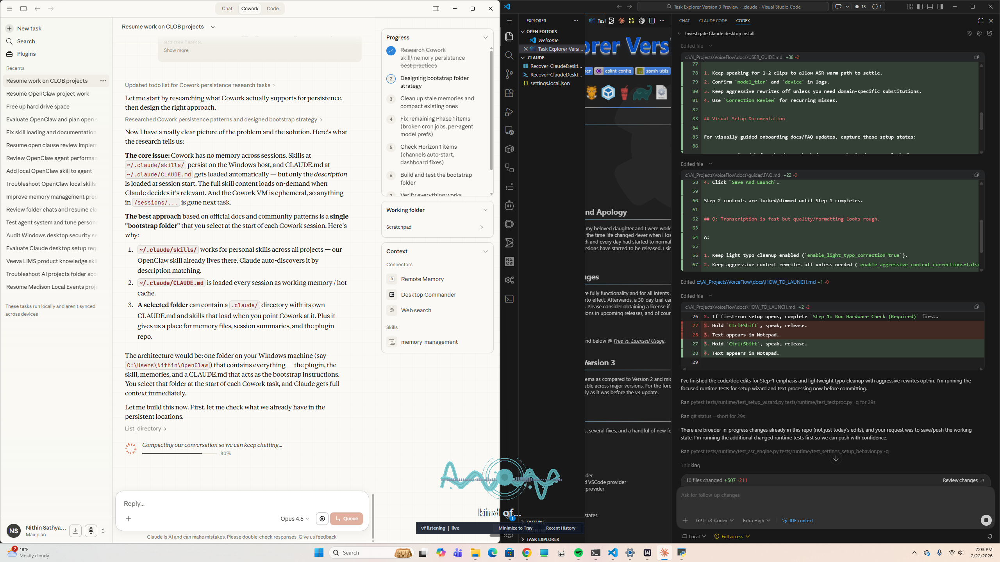

# VoiceFlow User Guide

## Core Workflow

1. Focus the target app.
2. Hold push-to-talk (`Ctrl+Shift` by default).
3. Speak.
4. Release to transcribe and insert text.

## UI Surfaces

VoiceFlow is intentionally tray-first:

- Setup wizard: first-run defaults and advanced overrides.
- Tray menu: primary settings and actions.
- Overlay + dock: status and recent transcript visibility.
- Recent History + Correction Review: fast correction loop.

There is currently no separate "Command Center" window in the active runtime.

## Tray Settings Map

Use this as a visual click-path map:

| Goal | Click Path | Persists In Config |
|---|---|---|
| Open setup wizard | Tray -> `Setup & Defaults` | `setup_*` fields + selected defaults |
| Toggle code mode | Tray -> `Code Mode` | Session toggle (runtime state) |
| Choose paste vs type injection | Tray -> `Injection` | `paste_injection` |
| Auto-press Enter after paste | Tray -> `Auto-Enter` | `press_enter_after_paste` |
| Show/hide visual indicators | Tray -> `Visual Indicators` | `visual_indicators_enabled` |
| Show/hide dock | Tray -> `Dock` | `visual_dock_enabled` |
| Change push-to-talk preset | Tray -> `PTT Hotkey` -> pick preset | `hotkey_*` fields |
| Open transcript history | Tray -> `Recent History` | n/a |
| Open correction workflow | Tray -> `Correction Review` | n/a |

Also available via hotkeys:

- `Ctrl+Alt+C`: toggle code mode
- `Ctrl+Alt+P`: toggle paste/type injection
- `Ctrl+Alt+Enter`: toggle auto-enter

## Setup Wizard

At startup, VoiceFlow can show a setup wizard before the main runtime starts.

- First startup flow highlights Step 1 as the required action:
  - `Step 1: Run Hardware Check (Required)`
  - Step 2 controls are intentionally locked/dimmed until the check completes.
- Recommended mode: chooses defaults based on hardware detection.
- CPU-compatible mode: safest fallback for broad compatibility.
- GPU-balanced mode: optimized for CUDA-capable systems.
- `Run Hardware Check`: re-detect hardware and reset profile preview to recommended defaults.
- Choose one profile after check (`Recommended`, `CPU Compatible`, or `GPU Balanced`) before `Save And Launch`.
- Advanced section: device/compute/model/injection overrides.

You can reopen the same wizard from tray:

- Right-click tray icon -> `Setup & Defaults`

If setup is incomplete, startup stays gated until setup is saved (or setup is explicitly skipped via env flag).

## Transcription Quality and Formatting

Speed-first defaults now separate lightweight cleanup from aggressive rewrites:

- `enable_light_typo_correction=true`
  - Low-latency typo/spelling cleanup (safe regex pass).
  - Runs before destination formatting and injection.
- `enable_aggressive_context_corrections=false`
  - Disables risky phrase rewrites unless explicitly enabled.
  - Useful if you observed over-correction in normal dictation.
- `destination_aware_formatting=true`
  - Keeps line wrapping/paragraph shaping suited to target app.

If quality drops mid-session:

1. Keep speaking for 1-2 clips to allow ASR warm path to settle.
2. Confirm `model_tier` and `device` in logs.
3. Keep aggressive rewrites off unless you need domain-specific substitutions.
4. Use `Correction Review` for recurring misses.

## Visual Setup Documentation

For visually guided onboarding docs/FAQ updates, capture these setup states:

1. Startup wizard before hardware check (Step 1 emphasized, Step 2 locked).
2. Startup wizard during hardware check.
3. Startup wizard after hardware check (Step 2 unlocked, profile selected).

Recommended asset naming:

- `assets/setup-startup-step1-required.png`
- `assets/setup-startup-check-running.png`
- `assets/setup-startup-step2-unlocked.png`

Current reference screenshots:





## Accent and Personalization

VoiceFlow keeps personalization enabled:

- Recent transcript history
- Correction review workflow
- Daily learning from correction data
- Local engineering terms dictionary support

Fastest way to improve accent-specific output:

1. Open `Correction Review` from tray.
2. Correct recurring misses.
3. Let daily learning process those corrections.

Daily learning commands:

```powershell
.\VoiceFlow_DailyLearning.bat
.\VoiceFlow_DailyLearning.bat --dry-run
```

Schedule daily learning:

```powershell
powershell -ExecutionPolicy Bypass -File .\scripts\setup\register_daily_learning_task.ps1 -StartTime "08:00" -Force
```

## Model and Hardware Defaults

Out-of-box defaults:

- `device=auto`
- `model_tier=quick`

Runtime behavior:

- CUDA available: GPU path with `float16`
- No CUDA: CPU path with `int8`

Optional tier overrides:

- `tiny`: lowest latency
- `quick`: default adaptive tier
- `balanced`: higher quality with good speed (best on GPU)
- `quality`: best recognition, slower

## Advanced Config and Logs

- Config: `%LOCALAPPDATA%\LocalFlow\config.json`
- Logs: `%LOCALAPPDATA%\LocalFlow\logs\localflow.log`

Injection reliability defaults:

- `inject_require_target_focus=true`
- `inject_refocus_on_miss=true`
- `inject_refocus_attempts=3`
- If final injection misses due focus drift, transcript is copied to clipboard for manual paste.

For troubleshooting and quick issue triage, use [`docs/guides/FAQ.md`](guides/FAQ.md).
