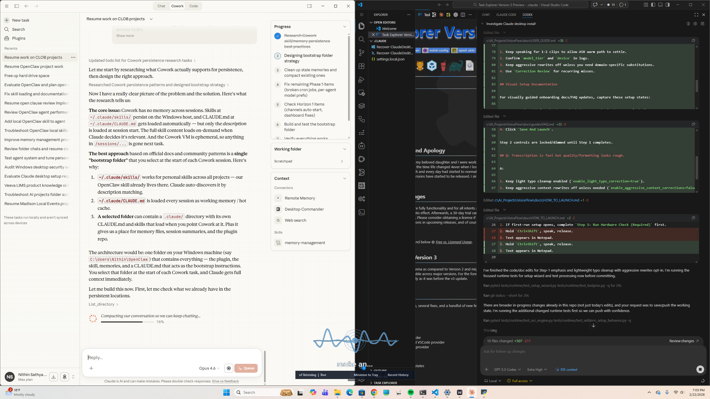
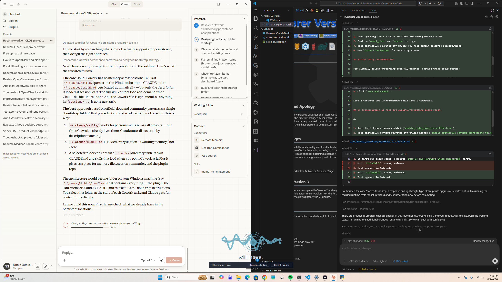

# VoiceFlow FAQ (Windows)

## Quick Click Paths

Use these first before editing config files manually.

| Need | Click Path |
|---|---|
| Open setup wizard | Tray -> `Setup & Defaults` |
| Change push-to-talk key | Tray -> `PTT Hotkey` |
| Toggle code formatting mode | Tray -> `Code Mode` |
| Switch paste vs typing injection | Tray -> `Injection` |
| Toggle auto-enter | Tray -> `Auto-Enter` |
| Open transcript history | Tray -> `Recent History` |
| Correct transcript mistakes | Tray -> `Correction Review` |
| Toggle status visuals | Tray -> `Visual Indicators` / `Dock` |

## Q: App transcribes but text does not insert into my target window.

A:

1. Click back into the target app and press `Ctrl+V` once.
2. Check if a popup/notification stole focus during key release.
3. Review `%LOCALAPPDATA%\LocalFlow\logs\localflow.log` for `inject_focus_drift`.

VoiceFlow keeps a clipboard fallback for focus-drift edge cases.

## Q: VoiceFlow keeps pressing Enter after each transcription.

A:

1. Open tray -> `Auto-Enter`.
2. Turn it off.
3. Retry one short dictation.

Default stable behavior is paste-only on release; auto-Enter is opt-in.

## Q: App is stuck in processing/transcribing.

A:

1. Confirm you are on `v3.1.5` or newer.
2. Fully exit VoiceFlow, then relaunch.
3. Confirm only one runtime instance is active.
4. Check log lines for active device routing:
   - `asr_engine_initialized ... device=... compute=...`

If this persists, capture the last 100 lines of `localflow.log` and include them in your issue report.

## Q: Long dictation is slower than expected.

A:

1. Keep `model_tier=quick` unless you intentionally need max quality.
2. Validate runtime route in logs (`device=cpu` or `device=cuda`).
3. Keep one active VoiceFlow instance.
4. Retry with a short and then long sample to compare timing.

## Q: Setup wizard only lets me run hardware check first. Is that expected?

A:

Yes. In startup flow, Step 1 is intentionally required before Step 2:

1. Click `Step 1: Run Hardware Check (Required)`.
2. Wait for the check to complete.
3. Pick `Recommended`, `CPU Compatible`, or `GPU Balanced`.
4. Click `Save And Launch`.

Step 2 controls are locked/dimmed until Step 1 completes.

Visual reference:




## Q: Transcription is fast but quality/formatting looks rough.

A:

1. Keep light typo cleanup enabled (`enable_light_typo_correction=true`).
2. Keep aggressive context rewrites off unless needed (`enable_aggressive_context_corrections=false`).
3. Verify destination-aware formatting is on (`destination_aware_formatting=true`).
4. Use `Correction Review` for recurring misses and run daily learning.

## Q: How do I improve recognition for my accent or repeated terms?

A:

1. Use tray -> `Correction Review` for misses.
2. Keep adaptive learning enabled.
3. Run daily learning job:

```powershell
.\VoiceFlow_DailyLearning.bat
```

For deep tuning, see `docs/USER_GUIDE.md` and `docs/TECHNICAL_OVERVIEW.md`.

## Q: Is there a separate command-center settings window?

A:

Not in the current active runtime. Configuration is setup-wizard + tray-first, plus overlay/dock and history/review panels.

## Q: Where are config, logs, and user-learning files?

A:

- Config: `%LOCALAPPDATA%\LocalFlow\config.json`
- Logs: `%LOCALAPPDATA%\LocalFlow\logs\localflow.log`
- Fallback logs: `%LOCALAPPDATA%\LocalFlow\logs\localflow-<pid>.log`
- Recent history: `%LOCALAPPDATA%\LocalFlow\recent_history_events.jsonl`
- Corrections: `%LOCALAPPDATA%\LocalFlow\transcription_corrections.jsonl`
- Adaptive patterns: `%LOCALAPPDATA%\LocalFlow\adaptive_patterns.json`
